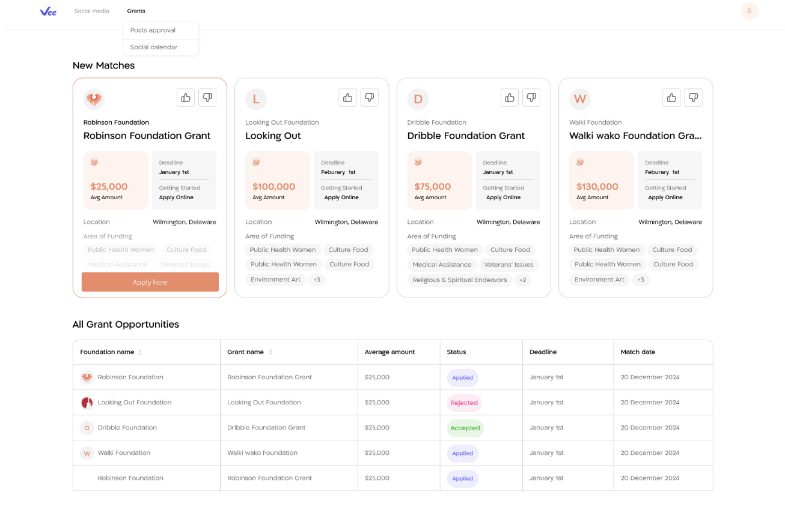

Grants dashboard - it’s a dashboard that shows customers the grant opportunities offered (the card view) for
them and the historical grants they approved as relevant (the table view).

You are required to build a BE and a FE to serve the above page.

## BE requirements:

### Technical Requirements ⚙
- The backend must be implemented using the NestJS framework.
- The API must be exposed via GraphQL, following industry best practices.
- GraphQL must use a schema-first approach.
- The codebase must be written in TypeScript.
- The application must be packaged and runnable using Docker.
- The project must include a basic automated test setup.
- A persistent data layer must be used (Ideally Postgres)

### Functional Requirements 🧩
- The GraphQL API must expose operations to:
  - Fetch opportunities.
  - Submit feedback for an opportunity.
  - Update opportunity status based on feedback (approved / rejected).
- When feedback is submitted:
  - The feedback must be persisted in the database.
  - The opportunity state must be updated accordingly.
- The API must return consistent and predictable responses suitable for frontend consumption

### Evaluation Criteria 📋
- Correct usage of NestJS and GraphQL schema-first architecture.
- Proper separation of concerns (modules, resolvers, services, domain logic).
- Clean project structure and maintainable code organization.
- Correct persistence strategy and data modeling.
- Presence and quality of automated tests.
- Docker configuration quality and reproducibility.
- Code readability, naming consistency, and clarity.

## FE requirements:

### Technical ⚙
- Use any React stack (React, Vite, Next.js, etc.) - We encouraging to use NextJS
- Feel free to use any tool that you are comfortable with. (state management,component library etc)
- Design matters. Try to implement the UI as close as possible to the design shown in the screenshot.

### Functional 🧩
- Each opportunity is displayed as a card.
- The only clickable actions on a card are:
  - 👍 Thumbs Up
  - 👎 Thumbs Down
- When the user clicks 👍 or 👎:
  - A feedback input is displayed.
  - The user can enter text feedback.
  - The user can submit the feedback.
- When feedback is submitted:
  - The feedback is saved.
  - If 👍 was selected:
    - The opportunity moves to the “All Grant Opportunities" table.
  - If 👎 was selected:
    - The opportunity is removed from the card view and disappears

### Evaluation Criteria 📋
- Clear separation of business logic from UI logic.
- Component structure and state organization.
- Correct implementation of the feedback flow.
- Code readability and maintainability.

### General requirements:
- We should be able to run both BE and FE.
